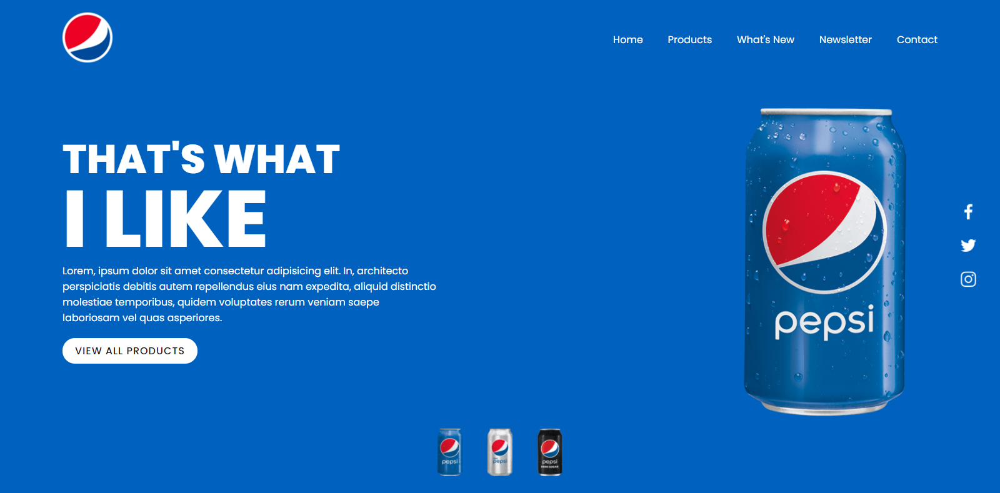
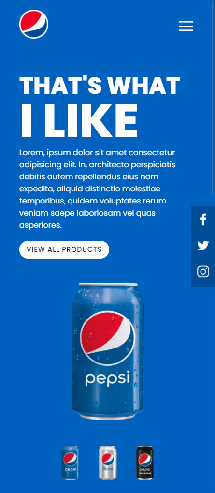

<div align="center">


[](https://twitter.com/intent/follow?screen_name=jrpranav)

<br />
<br />


<h2 align="center">Pepsi - Landing Page</h2>

Pepsi is a fully responsive landing page website, responsive for all devices, built using HTML, CSS, and JavaScript.

<a href="https://jrpranav.github.io/pepsi.git"><strong>➥ Live Demo</strong></a>

</div>

<br />

### Demo Screenshots




### Prerequisites

Before you begin, ensure you have met the following requirements:

- [Git](https://git-scm.com/downloads "Download Git") must be installed on your operating system.

### Run Locally

To run **Pepsi Landing Page**, run this command on your git bash:

Linux and macOS:

```bash
sudo git clone https://github.com/codewithsadee/pepsi.git
```

Windows:

```bash
git clone https://github.com/codewithsadee/pepsi.git
```

### Contact

If you want to contact with me you can reach me at [Twitter](https://www.twitter.com/jrpranav).

### License

MIT
